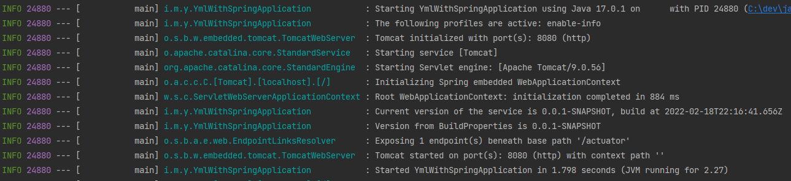

# yml-with-spring

Sample project to test the yaml and properties processing introduced with spring-boot 2.4.0.M2.

Details here: https://spring.io/blog/2020/08/14/config-file-processing-in-spring-boot-2-4

And to check if the yaml can get the information coming from maven build. In detail, it is possible to retrieve the version as well as the build time, using the new `spring.config.import` to import the `build-info.properties`. The latter has been generated by the `spring-boot-maven-plugin`. And the actual import comes from a yaml file inside a dependency module in a similar way to what a framework can do.

